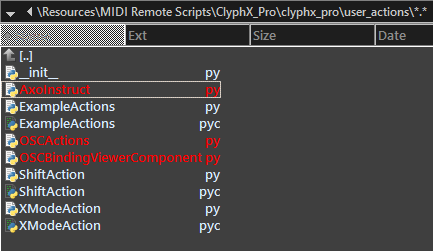
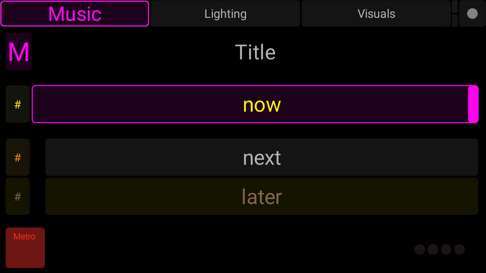
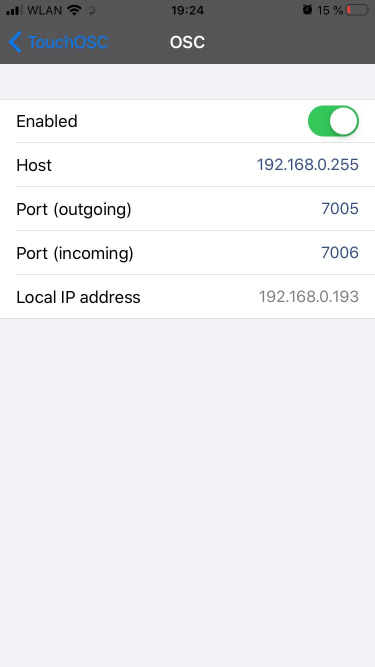
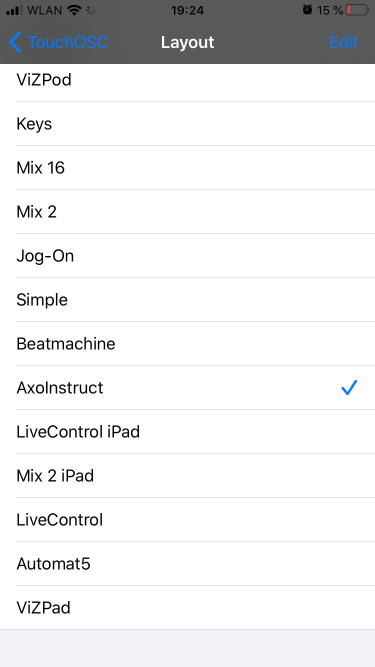
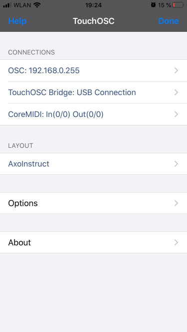
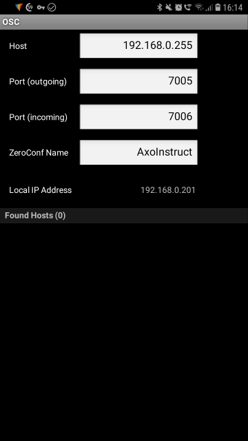
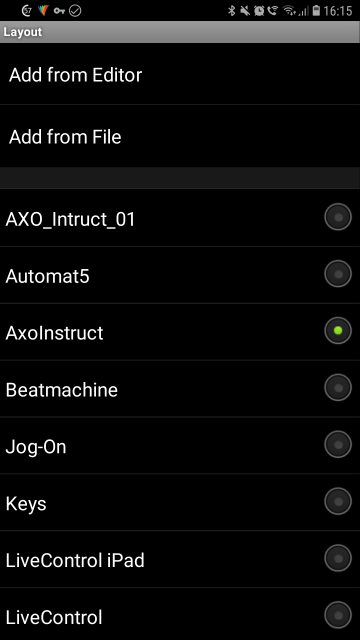
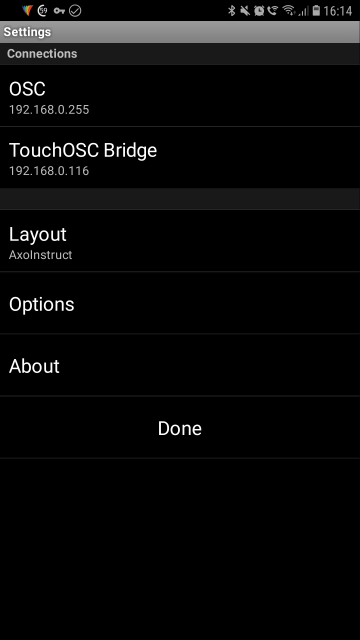
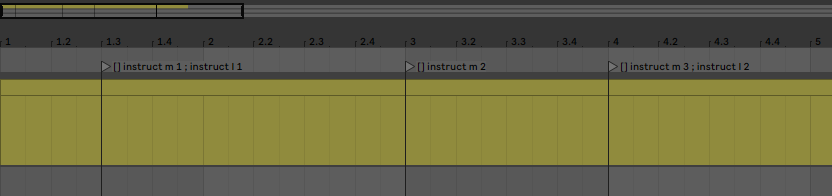

# AxoInstruct
Multi-user cue lists and stage instructions with Ableton Live, ClyphX Pro and OSC \
Create cue lists for live performances and send stage instructions to your mobile devices.


## Supports
* Multiple users/artists
* Mobile devices
* Extendible cue lists with any number of songs (acts), cues or artists
* Display of current cue and outlook on what's coming next

## Requires
* [Ableton Live](https://www.ableton.com/en/live/) -- Version 9.7 or higher
* [ClyphX Pro](https://isotonikstudios.com/product/clyphx-pro/) Version 1.1.8 or higher
* [ClyphX Pro OSC User Actions (beta)](http://forum.nativekontrol.com/thread/3620/beta-osc-output-clyphx-pro) -- Download from the official ClyphX Pro forum
* [Max4Live](https://www.ableton.com/en/live/max-for-live/) or Ableton Live Suite -- (optional, for midi note triggers)
* [TouchOSC](https://hexler.net/products/touchosc) or comparable OSC-enabled software

## Setup and installation
### Step 1: Downloads
* Download or clone this repository
* Download the OSC User Actions (beta) from the [ClyphX Pro forum](http://forum.nativekontrol.com/thread/3620/beta-osc-output-clyphx-pro)
* On your mobile device: Download TouchOSC from your favourite App Store

### Step 2: Files and folders
#### AxoInstruct files
Copy the file `AxoInstruct.py`from this repository to the `user_actions` folder of your ClyphX Pro installation. \
If you have Live 10 on a Windows system, this will be `C:\ProgramData\Ableton\Live 10 Suite\Resources\MIDI Remote Scripts\ClyphX_Pro\clyphx_pro\user_actions`

#### ClyphX Pro OSC files
Before you begin, make sure that you are using ClyphX Pro Version 1.1.8 or higher. \
Copy the OSC User Actions Python files into the `user_actions` folder of your ClyphX Pro installation. \
If you have Live 10 on a Windows system, this will be `C:\ProgramData\Ableton\Live 10 Suite\Resources\MIDI Remote Scripts\ClyphX_Pro\clyphx_pro\user_actions`

If you have successfully completed this step, the `user_actions` folder should contain the highlighted files: \


### Step 3: Network settings
Edit the `Preferences.txt` of ClyphX Pro installation add settings for outgoing OSC communication. \
On a Windows machine the file is located here: `c:\Users\[YourUserName]\nativeKONTROL\ClyphX_Pro\Preferences.txt`.

Snippet of my `Preferences.txt` file and the settings I am using:

```
#************************************* [OSC SETTINGS] **********************************
# This setting determines the OSC port number that ClyphX Pro will receive OSC messages from.
# The possible settings are any OSC port number.
INCOMING_OSC_PORT = 7005
OUTGOING_OSC_PORT = 7006
OSC_DEVICE_IP_ADDRESS = 192.168.0.255
```

OSC is based on IP network communication rather than Midi. ClyphX Pro needs the following settings or send and receive OSC messages.

* `INCOMING_OSC_PORT = 7005` ClyphX Pro will listen on this port for incoming OSC messages. This port number has to match the outgoing port number of the OSC apps on your mobile devices.
* `OUTGOING_OSC_PORT = 7006` Clyphx Pro will send OSC messages to this port number on other devices. Make sure you have different numbers for incoming and outgoing ports. \ On your mobile device, configure the incoming port with the same number.
* `OSC_DEVICE_IP_ADDRESS = 192.168.0.255` Usually, this is the IP address of your mobile device, the address, ClyphX Pro will send all the OSC messages to. In this case however it's the broadcast address of an entire network. Please read the remarks below.

Remarks:
* The IP address setting is strongly depending on your network infrastructure. In my case, my computer running Ableton Live has the IP address 192.168.0.105. My mobile device has the IP address 192.168.0.201. Both starting with 192.168.0 (and given a network mask 255.255.255.0) means they are in the same network.
* This is important: both your computer and your mobile device have to directly "see" each other. They have to be in the same network.
* If you want to send OSC messages to only one single device you can specify the receiver's address explicitly, like `OSC_DEVICE_IP_ADDRESS = 192.168.0.201`.
* AxoInstruct was designed serving multiple users in parallel. For this reason `OSC_DEVICE_IP_ADDRESS = 192.168.0.255` is set to the broadcast address of your network. This means that every computer or mobile device in the 192.168.0.1 - 192.168.0.254 address range will receive the messages.
* Static IP addresses for all your devices are advisable in some situations to have better control over your used addresses.
* If this is too much network gibberish for you, ask a tech-savvy nerd in your circle of friends. :-)


### Step 4: TouchOSC on your mobile device
If you use TouchOSC on Android or iOS, transfer the `AxoInstruct.touchosc` file to your device. More information on TouchOSC installation and template file transfer, refer to the [TouchOSC homepage](https://hexler.net/products/touchosc)
\ \ The basic AxoInstruct GUI will look like this: \


The TouchOSC settings have configured to the corresponding OSC network settings of ClyphX Pro (see above). The incoming port number of TouchOSC has to match the outgoing port number on your computer and vice versa.

TouchOSC on iOS: \
  

TouchOSC on Android: \
  

#### Step 5: AxoInstruct XML Cuelist
Find a folder for your cuelist XML file and remember the location. You will need the file path for setting up AxoInstruct in your Ableton Live set.


## Usage
### Initialization
AxoInstructs needs to be initialized first. Usually. I usually have a setup scene in session view containing a clip called `[] init_instruct "c:/path/to/your/cuelist.xml"`. Specifying a file path allows you to use different cue lists for each Live set or even multiple cue list per Live set if needed.
If you omit the file path in the clip's name, AXOInstruct will use the script which is specified by default in `AxoInstruct.py`.


### Switching between songs
Each XML cue list is capable of holding as many songs as you need. But there can always be only one song selected. The `prep` actions lets you switch between songs.
Since my Live sets are usually built around the session view, I have clips for that: e.g. `[] prep demo1` where "demo1" denotes a song's `song_id` from the XML cue list file:

```
<?xml version="1.0"?>
<collection>
    <song song_id="demo1" title="Demo Song 1">
```

The prep action parses the XML file and automatically displays the first cue for all categories (music/lighting/visuals). You don't have to manually select the first cue.

### Selecting cues
Example action: `[] instruct v 2` -- where "v" denotes the category visuals, "l" as in lighting and "m" as in music. "2" displays the second cue as well as the two subsequent cues. If you choose a number that is larger than the specified number of cues (like 1337), the display will show `--`.


## Different ways to use AxoInstruct
### Clips and/or Scenes in Session View


### Locators in Arrangement View


### Drum Racks with Max4Live Device for Midi Note Triggering
Ableton Drum Rack and the ClyphX Pro `Note Trigger Handler` Max4Live Ensemble


Note: The depicted M4L devices is not included in the demo `AxoInstructDemo.als`set since it's the intellectual property of NativeKontrol. Please use the M4L devices that comes along with your ClyphX Pro installation.
