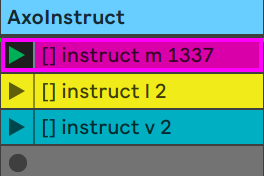
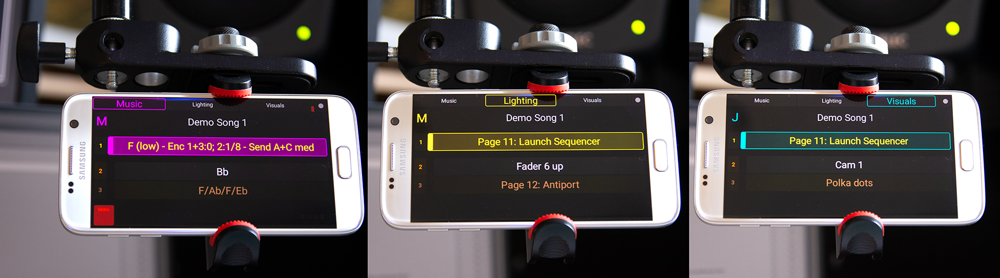
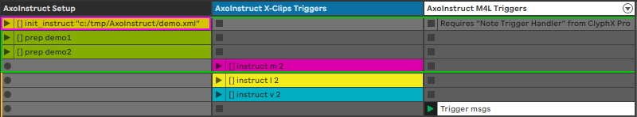
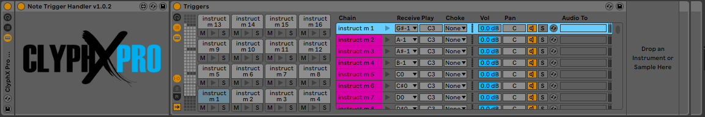
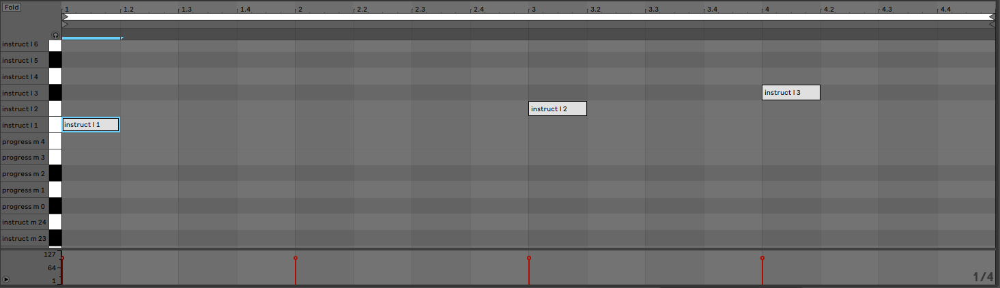

# AxoInstruct
Multi-user cue lists and stage instructions with Ableton Live, ClyphX Pro and OSC
Create cue lists for live performances and send stage instructions to your mobile devices.





## Supports
* Multiple users/artists
* Mobile devices
* Extendible cue lists with any number of songs (acts), cues or artists
* Display of current cue and outlook on what's coming next

## Requires
* [Ableton Live](https://www.ableton.com/en/live/)
* [ClyphX Pro](https://isotonikstudios.com/product/clyphx-pro/) with [OSC User Actions (beta)](http://forum.nativekontrol.com/thread/3620/beta-osc-output-clyphx-pro)
* [Max4Live](https://www.ableton.com/en/live/max-for-live/) -- for midi note triggers (optional)
* [TouchOSC](https://hexler.net/products/touchosc) or comparable OSC-enabled software

## Setup
1. Download the OSC User Actions (beta) from the [ClyphX Pro forum](http://forum.nativekontrol.com/thread/3620/beta-osc-output-clyphx-pro) and copy them to the `user_actions` folder
2. Copy the file `AxoInstruct.py`from this repository to the `user_actions` folder
3. On your mobile device, have TouchOSC app installed and open the `AxoInstruct.touchosc` file on your device. More information on TouchOSC installation and template file transfer, refer to the [TouchOSC homepage](https://hexler.net/products/touchosc)
4. Find a folder for your cuelist XML file and remember the location. You will need the file path for setting up AxoInstruct in your Ableton Live set.
5. Edit the `Preferences.txt` of ClyphX Pro add settings for outgoing OSC communication:
```
#************************************* [OSC SETTINGS] **********************************
# This setting determines the OSC port number that ClyphX Pro will receive OSC messages from.
# The possible settings are any OSC port number.
INCOMING_OSC_PORT = 7005
OUTGOING_OSC_PORT = 7006
OSC_DEVICE_IP_ADDRESS = 192.168.0.255
```
Notes:
In this case, the broadcast address x.x.x.255 of a local network is used. This way, the OSC messages can be received by any device in the 192.168.0.x address range

## Session overview


## Max4Live rack for midi note triggering
Ableton Drum Rack and the ClyphX Pro `Note Trigger Handler` Max4Live Ensemble


